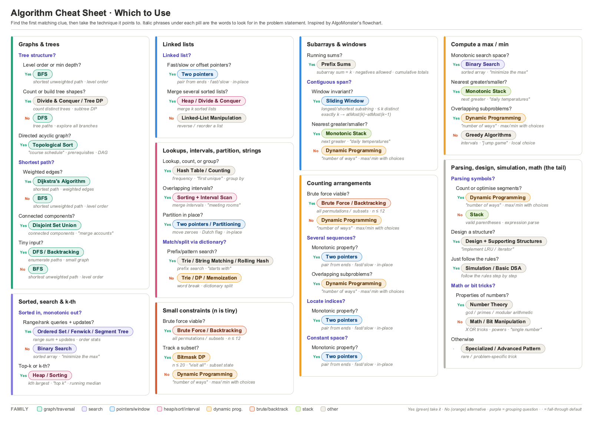
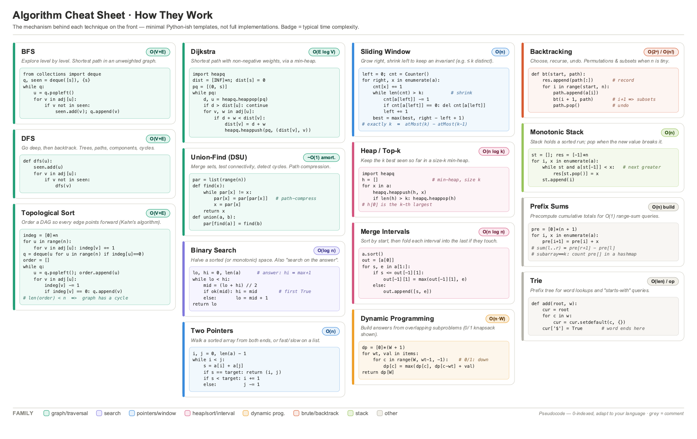

# Algorithm Cheat Sheet

A **two-sided A4 landscape PDF** — exact A4, prints with no scaling
([`algorithm-cheat-sheet.pdf`](algorithm-cheat-sheet.pdf)):

- **Front — selection flow.** Maps "clue in the problem statement" → "technique to
  reach for", inspired by the AlgoMonster flowchart.
- **Back — how they work.** A minimal Python-ish template for each technique on the
  front (the mechanism, not a full implementation) with its typical time complexity.

<p align="center">
  <a href="algorithm-cheat-sheet.pdf" target="_blank" rel="noopener noreferrer">
    
    
  </a>
</p>

## Editing

Both pages are generated from editable YAML — edit, then rebuild.

**Front** comes from [`flowchart.yaml`](flowchart.yaml). Each `section` is a titled
box whose `steps` are decision points read top to bottom. A step is a question with
`if_yes` (a "No" falls through to the next step), with `if_yes` + `if_no`, with a
nested `then:`, or a final `otherwise:` default. Each technique has a `use` (pill
label) and `when` (italic trigger phrases, ` · `-separated). The comment header in
`flowchart.yaml` has the full format and examples.

**Back** comes from [`algorithms.yaml`](algorithms.yaml). Each entry is a pattern
card with a `name`, a colour `family`, a `big_o` badge, a one-line `idea`, and a
`code` template (a YAML literal block — keep lines ≤ ~50 monospace chars). The comment
header there has the details.

Colours come from the shared [`config.py`](config.py) `FAMILY` palette (the front
derives a pill's family from its technique name via `fam()`; the back names its family
explicitly so both sides match). Layout constants live at the top of each builder;
text is measured via [`textmetrics.py`](textmetrics.py); and balancing the boxes
across 4 columns is automatic on both pages.

## Rebuild

Rendering uses `cairosvg`, which needs the native **cairo** library (not a pip package):

```bash
brew install cairo                 # macOS  (Ubuntu: sudo apt install libcairo2)
pip install -r requirements.txt
./build.sh                         # or: python3 build.py
```

Text is measured with a Helvetica/Arial-metric font auto-detected per platform; if
none is found, install Liberation Sans or set `ALGOSEL_FONT_REGULAR` /
`ALGOSEL_FONT_BOLD` to a TTF.

## Attribution & license

This sheet recreates only the *decision logic* — the general "which clue → which
technique" mapping — popularised by [AlgoMonster's flowchart](https://algo.monster/flowchart).
That logic is common computer-science knowledge (an idea/method, not copyrightable
expression); the wording, keyword phrases, colours, layout, and code here are
original, and **no AlgoMonster text, artwork, or assets are copied or redistributed**.
Independent study aid, **not affiliated with or endorsed by AlgoMonster** — the name
is used only nominatively to credit the inspiration; if their tool helps you, support
the original.

Code and YAML are released under the **MIT License** (see [`LICENSE`](LICENSE)). The
committed `algorithm-cheat-sheet.pdf` is a build output of `flowchart.yaml` (front)
and `algorithms.yaml` (back), which remain the source of truth.
